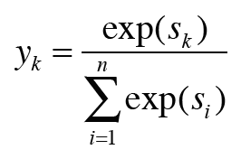
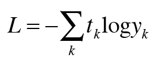
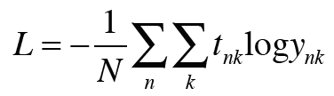
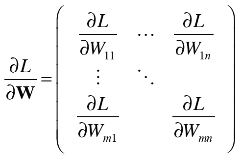
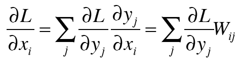
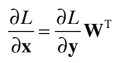

##1.3 신경망의 학습  
***
###1.3.1 손실 함수  
1. 손실: 학습 데이터(학습시 주어진 정답 데이터)와 신경망이 예측한 결과를 비교해 예측이 얼마나 나쁜지 산출한 단일값  

- 신경망 손실은 주로 손실함수 사용
- 다중 클래스 분류 신경망에서는 교차 엔트로피 오차 이용 (확률, 정답 레이블 사용해서 구한다.)
  
2. softmax  

  
출력이 총 n개일 때 k번째 출력을 구하는 계산식  
출력값: 0~1사이 실수-> 원소들을 모두 더하면 합=1 -> 확률로 해석 가능  
   
3. cross entropy error
   
  
softmax 확률 값이 교차 엔트로피 오차에 입력된다. 
log: 네이피어 상수(e를 밑으로 하는 로그)  
정답 레이블: t=[0,0,1] 과 같이 원핫 벡터로 표기  

- 원핫 벡터: 단 하나의 원소만 1이고 나머지는 0인 벡터 -> 1인 원소가 정답 클래스에 해당한다.

  
N개 미니배치 처리 고려했을 때 : 1개 당 평균 손실 함수 구함.  
미니배치 크기 관계없이 항상 일관된 척도 계산 가능

_이 책에서는 softmax with loss계층 하나로 구현: 역전파 계산 쉬워짐._  

***
###1.3.2 미분과 기울기  
1. 기울기
W가 m*n 행렬이라면 L=g(W) 함수의 기울기:  

  

- W와 기울기값의 형상이 동일하다.
- 매개변수 갱신, 연쇄법칙 쉽게 구현 가능  

***
###1.3.3 연쇄 법칙  
1. 오차 역전파법  

- 손실의 기울기를 사용해 매개변수 갱신 가능  
- 신경망 기울기 구하는 방법: __오차 역전파법__  
- 연쇄법칙: 합성함수에 대한 미분 법칙  

***
###1.3.4 계산 그래프  
- 계산 그래프: 노트, 화살표로 표시  

1. 곱셈 노드  
    - 상류로부터 받은 기울기에 순전파이 입력을 서로 바꾼 값(x면 y, y면 x)  

2. 분기 노드  
   - 단순히 선이 두개로 나뉘는데 이때 같은 값이 복제되어 분기한다.(=복제 노드)  
   - 그 역전파는 상류에서 온 기울기들의 합  
   
3. Repeat 노드  
   - 2개로 분기하는 분기 노드 일반화할 때 N개로의 분기(복제) 라고 하는 데 이를 Repeat 노드라고 한다.  

```python
import numpy as np
D,N=8,7
x=np.random.randn(1,D)
y=np.repeat(x,N, axis=0) #순전파(원소 복제) : x를 N번 복제한다. axis: 어느 축 방향으로 복제할 지 조정 가능(=세로)
dy=np.random.randn(N,D) #무작위 기울기
dx=np.sum(dy,axis=0,keepdims=True) #역전파 : 총 합 / 복제 방향 / 2차원 배열 차원 수 유지(True: 1,D / False: D)
```

4. Sum 노드  
```python
import numpy as np
D,N=8,7
x=np.random.randn(N,D)
y=np.sum(x,N, keepdims=True) #순전파
dy=np.random.randn(1,D) #무작위 기울기
dx=np.repeat(dy,N, axis=0) #역전파
```
_sum 노드와 repeat 노드는 서로 반대 관계_  
_sum 노드의 순전파가 repeat 노드의 역전파.._  

5. MatMul 노드  
- 행렬 곱셈  
  
  
      
  - 마지막 식을 통해 행렬의 곱을 '내적' 사용해서 계산 가능
    
- 이를 역으로 취해 역전파의 수식 구현 가능  
_1_3_MatMul.py 함수에서 계층 구현_  
  - a=b , a[...]=b 차이  
    * a=b : a가 가리키는 메모리 위치가 b가 가리키는 위치와 같아진다 / 실제로 데이터는 복제되지 않는 얕은 복사  
    * a[...]=b : a가 가리키는 메모리에 b의 원소가 복제된다. / 실제 데이터가 복제된다는 깊은 복사  
    * 생략 기호를 사용해서 변수의 메모리 주소를 고정할 수 있다. -> 인스턴스 변수 grads를 다루기 더 쉬워진다.

