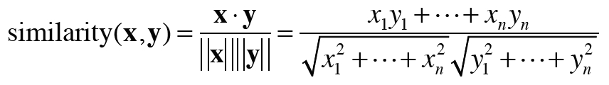

## 2.3 통계 기반 기법  
* 말뭉치 (corpus) : 대량 텍스트 데이터  
* 사람의 지식으로 가득한 말뭉치에서 자동으로, 효율적으로 핵심 추출하는 기법  

_corpus 가 단어 각각에 품사 레이블링될 수도 있음 -> 트리 구조로 가공해줘야 한다._  

***
### 2.3.1 파이썬으로 말뭉치 전처리하기  
1. 전처리 : 텍스트 데이터를 단어로 분할하고 분할된 단어들을 단어 ID 목록으로 변환하는 작업  
    * 원래 문장을 단어 목록 형태로 분할해서 리스트에 저장한다.  
    * 단어에 ID 부여하고 ID의 리스트로 이용할 수 있도록 처리
    * dictionary 사용하면 단어로 id검색 or id 로 단어 검색 가능  
    * 단어 목록을 단어 id 목록으로 변경하기
    ```python
   import numpy as np
   def preprocess(text):
        text = text.lower()
        text = text.replace('.', ' .')
        words = text.split(' ')
    
        word_to_id = {}
        id_to_word = {}
        for word in words:
            if word not in word_to_id:
                new_id = len(word_to_id)
                word_to_id[word] = new_id
                id_to_word[new_id] = word
    
        corpus = np.array([word_to_id[w] for w in words])
        return corpus, word_to_id, id_to_word 
   
   text='You say goodbye and I say hello.'
   corpus, word_to_id, id_to_word = preprocess(text)
   ```
***
### 2.3.2 단어의 분산 표현  
* 색을 벡터로 표현하듯 단어도 벡터로 표현할 수 있다?  
* 단어의 의미를 정확하게 파악할 수 있는 벡터 표현 = 분산 표현  

_단어의 분산 표현은 단어를 고정 길이의 밀집 벡터 (dense vector)로 표현한다._   
_밀집벡터 : 대부분의 원소가 0이 아닌 실수인 벡터._  
***
### 2.3.3 분포 가설  
* 분포 가설 : 단어의 의미는 주변 단어에 의해 형성된다.  
* 단어가 사용된 맥락이 단어의 의미를 형성한다.  
* 맥락 : (주목하는 단어) 주변에 놓인 단어 -> window size=2 일때 단어 앞 뒤 두 단어 (총 4개) 가 맥락  

***
### 2.3.4 동시 발생 행렬  
* 통계 기반 기법 (statistical based) : 주변에 어떤 단어가 몇 번이나 등장하는지 세어 집계하는 방법  
1. 우선 corpus 를 전처리한다.  
2. 맥락에 포함되는 단어의 빈도를 표로 정리한다.  
* 동시 발행 행렬
```python
import numpy as np
C=np.array([
    [0,1,0,0,0,0,0],
    [1,0,1,0,1,1,0],
    [0,1,0,1,0,0,0],
    [0,0,1,0,1,0,0],
    [0,1,0,1,0,0,0],
    [0,1,0,0,0,0,1],
    [0,0,0,0,0,1,0],
], dtype=np,int32)

print(C[0])
#[0 1 0 0 0 0 0] : id가 0인 단어의 벡터 표현
print(C[Word_to_id['goodbye']]) # goodbye의 벡터 표현
#[0 1 0 1 0 0 0]
```

* 말뭉치로부터 동시발생 행렬 만들어주는 함수  
```python
import numpy as np
def create_co_matrix(corpus, vocab_size, window_size=1): # 단어 id 리스트, 어휘 수, 윈도우 크기
    corpus_size=len(corpus) 
    co_matrix=np.zeros((vocab_size, vocab_size), dtype=np.int32)

    for idx, word_id in enumerate(corpus):
        for i in range(1, window_size+1):
            left_idx= idx-1
            right_idx= idx+1
            if left_idx >= 0 :
                left_word_id = corpus[left_idx]
                co_matrix[word_id, left_word_id] +=1
             if right_idx <corpus_size :
                right_word_id = corpus[right_idx]
                co_matrix[word_id, right_word_id] +=1
    return co_matrix
```

### 2.3.5 벡터 간 유사도  
* 단어 벡터 사이의 유사도 측정 방법: 코사인 유사도 (cosine similarity)  
  
  - 분자 : 벡터 내적   
  - 분모 : 벡터 norm (L2 norm)  
   

* 코사인 유사도 함수
```python
import numpy as np
def cos_similarity(x,y):
    nx=x/np.sqrt(np.sum(x**2))
    ny=y/np.sqrt(np.sum(y**2))
    return np.dot(nx, ny)
```
   * x,y 정규화 한 후 두 벡터의 내적 계산.
   * 인수에 제로 벡터가 오면 'divide by zero' 오류 발생 -> solve: 나눌 때 분모에 작은 값 더해주기 (eps)  
   * eps : 1e-8 (0.00000001)  
```python
import numpy as np
def cos_similarity(x,y, eps=1e-8):
    nx=x/np.sqrt(np.sum(x**2)+eps)
    ny=y/np.sqrt(np.sum(y**2)+eps)
    return np.dot(nx, ny)
```

   
* "you", "i" 사이 유사도 구하기  
   * 코사인 유사도 값은 -1~1 사이 이므로 비교적 유사성이 크다.
```python
import sys
sys.path.append('...')
import preprocess, create_co_matrix, cos_similarity #위에서 구현한 함수 사용

text='You say goodbye and I say hello.'
corpus, word_to_id, id_to_word = preprocess(text)
vocab_size=len(word_to_id)
C=create_co_matrix(corpus, vocab_size)

c0=C[word_to_id['you']] # you 의 단위 벡터
c1=C[word_to_id['i']] # i 의 단위 벡터
print(cos_similarity(c0, c1)) # 0.70...
```
***
### 2.3.6 유사 단어의 랭킹 표시  
* 어떤 단어가 검색어로 주어지면 그 검색어와 비슷한 단어를 유사도 순으로 출력하는 함수.
* 2.3.6.py 함수 구현