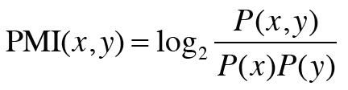
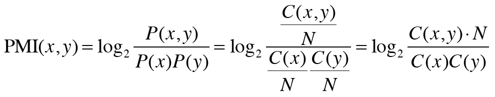
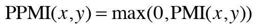
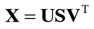

## 2.4 통계 기반 기법 개선하기  
* 단어의 동시발생 행렬 개선 작업  

***
### 2.4.1 상호정보량  
* 점별 상호정보량 (PMI) : pmi 값이 높을수록 관련성이 높다.  
 
  
    * p(x) : 단어 x가 말뭉치에 등장할 확률  
    * p(x,y) : 두 단어가 동시에 발생할 확률  
    

* 단어가 단독으로 출현하는 횟수가 고려됨.  
* 두 단어의 동시발생 횟수가 0 이면 오류 -> solution : 양의 상호정보량 (PPMI) 사용함.  
 
  * PMI 수가 음수일 때는 0으로 취급한다.
    
        _2.4.1.py PPMI 함수 구현_  
  
* PPMI 행렬 문제점 : 
  1. 말뭉치 어휘 수가 증가함에 따라 각 단어 벡터의 차원도 증가한다.  
  2. 행렬 원소 대부분이 0 이다. -> 각 원소의 중요도가 낮다.
  
***
### 2.4.2 차원 감소  
* 차원 감소 : 중요한 정보는 최대한 유지하면서 벡터의 차원을 줄이는 방법  
* 차원 감소시키는 방법 : 특이값 분해 (SVD : singular value decomposition)  
  * 임의의 행렬을 세 행렬의 곱으로 분해  
     
    * U : 직교 행렬, 단어 공간
    * S : 대각 행렬 , 특잇값이 큰 순서대로 나열
    * v : 직교 행렬
    * 특잇값 : 해당 축의 중요도  
  * S 행렬에서 특잇값이 작으면 중요도가 낮다는 뜻이므로 여분의 열벡터를 깎아내 원래 행렬을 근사한다.
  
### 2.4.3 SVD에 의한 차원 감소  
* numpy 의 linalg 모듈이 제공하는 svd 메서드로 실행 가능  

***
### 2.4.4 PTB 데이터셋  
*  PTB : 펜 트리뱅크