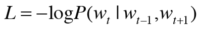
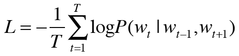
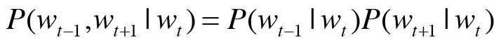
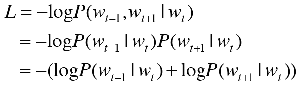
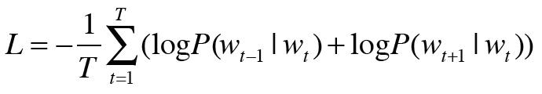

## 3.5 word2vec 보충  
### 3.5.1 CBOW 모델과 확률  
1. 사후 확률  
    * P(A) : A가 일어날 확률  
    * P(A,B) : A, B, 가 동시에 일어날 확률
    * P(A|B) : 사후확률: B가 주어졌을 때 A가 일어날 확률  
    
    * 타깃이 W_t 이고 맥락이 W_t-1, W_t+1 일때 W_t-1, W_t+1 가 주어졌을 때 W_t 가 될 확률 :  
        = P(W_t | W_t-1, W_t+1)  
  
2. CBOW 모델의 손실 함수  
* 음의 로그 가능도 (negativa log likelihood)
    
   
* 말뭉치 전체로 확장하면  
   
  

***
### 3.5.2 skip-gram 모델  
* skip-gram 모델 : 중앙 단어 (타깃) 로부터 주변의 여러 단어 (맥락) 추측  
    * 입력층 1개 (= 타깃)  
    * 출력층 맥락 수 만큼 존재 -> 각 출력층에서는 개별적으로 손실을 구하고 이 개별 손실들을 모두 더한 값을 최종 손실로 한다.  
        = P(W_t-1, W_t+1 | W_t)  유도 과정 : 
         
        
         
      

* 우리가 사용해야 하는 것 : skip-gram 모델  
```python

class SimpleSkipGram:
    def __init__(self, vocab_size, hidden_size):
        V, H = vocab_size, hidden_size

        # 가중치 초기화
        W_in = 0.01 * np.random.randn(V, H).astype('f')
        W_out = 0.01 * np.random.randn(H, V).astype('f')

        # 계층 생성
        self.in_layer = MatMul(W_in)
        self.out_layer = MatMul(W_out)
        self.loss_layer1 = SoftmaxWithLoss()
        self.loss_layer2 = SoftmaxWithLoss()

        # 모든 가중치와 기울기를 리스트에 모은다.
        layers = [self.in_layer, self.out_layer]
        self.params, self.grads = [], []
        for layer in layers:
            self.params += layer.params
            self.grads += layer.grads

        # 인스턴스 변수에 단어의 분산 표현을 저장한다.
        self.word_vecs = W_in

    def forward(self, contexts, target):
        h = self.in_layer.forward(target)
        s = self.out_layer.forward(h)
        l1 = self.loss_layer1.forward(s, contexts[:, 0])
        l2 = self.loss_layer2.forward(s, contexts[:, 1])
        loss = l1 + l2
        return loss

    def backward(self, dout=1):
        dl1 = self.loss_layer1.backward(dout)
        dl2 = self.loss_layer2.backward(dout)
        ds = dl1 + dl2
        dh = self.out_layer.backward(ds)
        self.in_layer.backward(dh)
        return None
```

***
### 3.5.3 통계 기반 vs 추론 기반  
1. 통계 기반 기법  
    * 말뭉치 전체 통계로부터 1회 학습해 단어의 분산 표현 얻음.  
    * 분산표현 갱신시 계산 처음부터 다시 해야 한다.  
    * 단어의 유사성 인코딩
2. 추론 기반 기법  
    * 말뭉치를 일부분씩 여러번 보면서 학습  
    * 분산표현 갱신시 매개변수 다시 학습 가능  
    * 단어 유사성 + 복잡한 단어 사이의 패턴 파악 가능  
        ex : king - man - woman = queen
      
3. 통계 기반 + 추론 기반 기법 = GloVe : 말뭉치 전체의 통계 정보를 손실 함수에 도입해 미니배치 학습을 하는 것