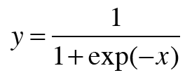
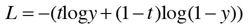

## 4.2. word2vec 개선 2  
* 은닉층 이후 처리 (행렬 곱과 Softmax 계층의 연산) = 네거티브 샘플링  

***
### 4.2.1 은닉층 이후 계산의 문제점  
* 시간 엄청 오래 걸림  

***
### 4.2.2 다중 분류에서 이진 분류로  
* 이진분류: 다중 분류를 이진분류로 근사 : yes/ no 로 대답할 수 있는 질문? 
* 은닉층과 출력충의 가중치 행렬의 내적은 한 개 벡터만 추출하고 추출된 벡터와 은닉층 뉴런과의 내적 계산. = 한 개의 단어만 사용해서 점수 계산  

***
### 4.2.3 시그모이드 함수와 교차 엔트로피 오차  
* 이진 분류 문제를 신경망으로 풀기 : 점수에 sigmoid 함수 적용해 확률로 변환하고 손실 구할 때는 손실 함수로 교차 엔트로피 오차 사용.  
* 시그모이드 함수 : 함수의 출력을 확률로 해석할 수 있다.  
   
  
* 교차 엔트로피 오차 : y는 시그모이드 함수 출력, t는 정답 레이블(0 or 1)
  
  

* 역전파의 y-t  
    * y : 신경망이 출력한 확률, t : 정답 레이블  
    * 정답 레이블이 1이면 y가 1에 가까워질수록 오차가 줄어들고, y가 1로부터 멀어지면 오차가 커짐.  
    * 오차가 크면 크게 학습, 오차가 작으면 작게 학습  
    
***
### 4.2.4 다중 분류에서 이진 분류로  
1. 은닉층 뉴런 h와 출력층 가중치 W_out 에서 특정 단어에 해당하는 단어 벡터와 내적 계산  
2. 그 출력을 Sigmoid with Loss 계층에 입력해 최종 손실을 얻는다. (정답 레이블 = 1)  
3. Embedding Dot 계층 도입해 Embedding 과 dot 연산(내적) 처리 합침  
* Embedding Dot 계층 구현  
```python
import numpy as np
class Embedding:
    def __init__(self, W):
        self.params=[W]
        self.grads=[np.zeros_like(W)]
        self.idx=None
    def forward(self, idx): # 가중치의 특정 행 뉴런 추출
        W,= self.params
        self.idx=idx
        out=W[idx]
        return out
    def backward(self,dout):
        dW,=self.grads
        dW[...]=0
        for i, word_id in enumerate(self.idx):
            dW[word_id]+=dout(i)
        #dW[self.idx]=dout
        return None
    
class EmbeddingDot:
    def __init__(self, W):
        self.embed=Embedding(W) #embed 계층
        self.params=self.embed.params #매개변수 저장
        self.grads=self.embed.grads #기울기 저장
        self.cache=None #순전파 계산 결과 잠시 저장
        
    def forward(self, h, idx): #순전파
        target_W=self.embed.forward(idx) 
        out=np.sum(target_W*h, axis=1) #내적 계산
        self.cache=(h,target_W)
        return out
    
    def backward(self, dout): #역전파
        h, target_W=self.cache
        dout=dout.reshape(dout.shape[0],1)
        dtarget_W=dout*h
        self.embed.backward(dtarget_W)
        dh=dout*target_W
        return dh
    
```

***
### 4.2.5 네거티브 샘플링  
* 긍정 뿐만 아니라 부정적인 예(오답) 입력했을 때?  
* 긍정적인 예에 대해서는 Sigmoid 계층의 출력을 1에 가깝게 만들고, 부정적인 예에 대해서는 Sigmoid 계층의 출력을 0에 가깝게 만들어주는 가중치 필요하다.  
* 적은 수의 부정적 예를 샘플링해 사용한다. : 네거티브 샘플링  
  
* 네거티브 샘플링: 긍정적인 예를 타깃으로 한 손실 구하고 동시에 부정적 예 몇 개 샘플링해 손실 구하고 이 손실을 더한 값을 최종 손실로 한다.  
    * 정답레이블: 1, 부정적 예에서 정답 레이블은 0이다.  
    
***
### 4.2.6 네거티브 샘플링의 샘플링 기법  
* 말뭉치의 통계 데이터를 기초로 샘플링하는 방법 : 자주 등장하는 단어 많이 추출, 드물게 등장하는 단어 적게 추출. (출현 횟수의 확률 분포)  
* 희소한 단어! 는 선택되기 어렵다.  
* np.random.choice() 메서드 사용 : 무작위 샘플링 + size 지정 + replace=False (중복 제거) + p(확률분포 담은 리스트 지정 -> 확률분포대로 샘플링) 
    * 확률분포에 0.75 제곱 : 원래 확률이 낮은 단어의 확률을 살짝 높임.  
    
```python
#UnigramSampler 클래스
import numpy as np
import collections
class UnigramSampler:
    def __init__(self, corpus, power, sample_size):
        self.sample_size = sample_size
        self.vocab_size = None
        self.word_p = None

        counts = collections.Counter()
        for word_id in corpus:
            counts[word_id] += 1

        vocab_size = len(counts)
        self.vocab_size = vocab_size

        self.word_p = np.zeros(vocab_size)
        for i in range(vocab_size):
            self.word_p[i] = counts[i]

        self.word_p = np.power(self.word_p, power)
        self.word_p /= np.sum(self.word_p)

    def get_negative_sample(self, target): # target으로 지정된 값을 긍정으로 해석, 그외 단어 id 샘플링
        batch_size = target.shape[0]

        if not GPU:
            negative_sample = np.zeros((batch_size, self.sample_size), dtype=np.int32)

            for i in range(batch_size):
                p = self.word_p.copy()
                target_idx = target[i]
                p[target_idx] = 0
                p /= p.sum()
                negative_sample[i, :] = np.random.choice(self.vocab_size, size=self.sample_size, replace=False, p=p)
        else:
            # GPU(cupy）로 계산할 때는 속도를 우선한다.
            # 부정적 예에 타깃이 포함될 수 있다.
            negative_sample = np.random.choice(self.vocab_size, size=(batch_size, self.sample_size),
                                               replace=True, p=self.word_p)

        return negative_sample

#사용
corpus=np.array([0,1,2,3,4,1,2,3])
power=0.75
sample_size=2

sampler=UnigramSampler(corpus, power, sample_size)
target=np.array([1,3,0]) #미니배치
negative_sample=sampler.get_negative_sample(target) #각 데이터에 대해 부정적인 예 2개씩 샘플링
print(negative_sample) # [[0 3] [1 2] [2 3]]
```

***
### 4.2.7 네거티브 샘플링 구현

```python
import numpy as np

 

class NegativeSamplingLoss:
    def __init__(self, W, corpus, power=0.75, sample_size=5):
        self.sample_size = sample_size
        self.sampler = UnigramSampler(corpus, power, sample_size)
        self.loss_layer = [SigmoidWithLoss() for _ in range(sample_size + 1)] #부정적 + 긍정적 1개
        self.embed_dot_layers = [EmbeddingDot(W) for _ in range(sample_size + 1)]
        self.params, self.grads = [], []
        for layers in self.embed_dot_layers:
            self.params += layer.params
            self.grads+= layer.grads
            
    def forward(self,h,target): #뉴런, 긍정적 target
        batch_size=target.shape[0]
        negative_sample=self.sampler.get_negative_sample(target) #부정적 예 샘플링해서 저장
        score=self.embed_dot_layers[0].forward(h,target)
        correct_label=np.ones(batch_size, dtype=np.int32)
        loss=self.loss_layer[0].forward(score, correct_label)
        
        negative_label=np.zeros(batch_size, dtype=np.int32)
        for i in range(self.sample_size):
            negative_target=negative_sample[:,i]
            score=self.embed_dot_layers[1+i].forward(h,negative_target)
            loss+=self.loss_layers[1+i].forward(score, negative_label)
            
        return loss

    def backward(self, dout=1):
        dh=0
        for l0, l1 in zip(self.loss_layers, self.embed_dot_layers):
            dscore=l0.backward(dout)
            dh+=l1.backward(dscore) 
        return dh
```