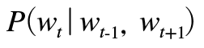
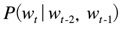
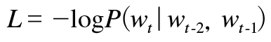
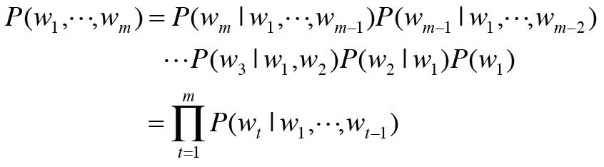
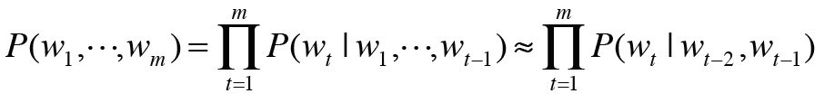

# chap5 순환 신경망(RNN)  
* 지금까지 살펴본 신경망 : 피드포워드 (feed forward) -> 시계열 데이터를 잘 다루지 못한다는 단점이 있다.  
* 순환 신경망 (Recurrent Neural Network)  

## 5.1 확률과 언어 모델  
### 5.1.1 word2vec 을 확률 관점에서 바라보다.  
1. w1......wt 로 표현되는 말뭉치에서 t번째를 타깃, 전후를 맥락으로 한다면 w_t-1, w_t+1을 이용해서 w_t를 추측하는 일 수행  
    * 사후 확률  
       
    
2. 맥락을 왼쪽 두 단어 (w_t-2, w_t-1)로 생각한다면  
      
   * 교차 엔트로피 오차에 의해 유도한 결과
     
     
### 5.1.2 언어 모델  
* 언어 모델 : 단어 나열에 확률 부여 -> 특정한 단어의 시퀀스에 대해 그 시퀀스가 일어날 가능성이 어느 정도인지 확률로 평가  
    * 기계 번역, 음성인식에 활용  
    * 각 단어가 w1....wm 순서로 출현할 확률 (= 동시 확률) : 사후 확률의 총 곱 (타깃 단어보다 왼쪽에 있는 모든 단어를 맥락으로 했을 때 확률)
      
      * 곱셈 정리로 유도  
    * 결국 우리의 목표는 P(W_t| W_1,...,w_t-1) 이라는 확률을 얻는 것. : 조건부 언어 모델  
    
***
### 5.1.3 CBOW 모델을 언어 모델로?  
* 맥락의 크기를 특정 값으로 한정해 근사적으로 나타내기 (왼쪽 두개 단어로 한정.) : 특정 길이로 고정~ 나머지는 무시.  
  
  
* BUT 순서 무시됨.  
* 단어 벡터를 은닉층에서 연결하는 방식 : RNN  
