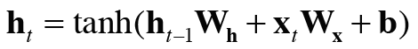

## 5.2 RNN이란  
*RNN : 순환하는 신경망 (Recurrent Neural Network)
***
### 5.2.1 순환하는 신경망  
1. RNN 특징  
    * 닫힌 경로  
    * RNN 계층 : 단어들의 분산 표현이 순서대로 하나씩 RNN 계층에 입력된다.
    * 출력이 두 개로 분기된다. : 같은 것이 복제되어 분기 출력 중 하나가 자기 자신에 입력된다. =순환  
    
***
### 5.2.2 순환 구조 펼치기  
1. FeedForward 구조 -> 다수의 RNN계층이 실제로는 같은 계층이다.  
2. 시계열 데이터 : 시간 방향으로 데이터 나열 -> 시계열 데이터의 인덱스를 가리킬 때는 '시각' 이라는 용어를 사용한다.  
    * 시각 t 의 RNN계층  
    
3. RNN계층 계산 수식  
  
    *(가중치 두개) W_x : 입력 x 를 출력 h로 변환하기 위한 가중치 
    * W_h : RNN 출력을 다음 시각의 출력으로 변환하기 위한 가중치
    * tanh 함수 사용해 변환 -> 결과값이 시각 t의 출력 h 가 된다.  
    
* 현재의 출력은 이전 출력을 기초해 계산됨. -> 상태를 가지는 계층, 메모리가 있는 계층  
* h_t : 은닉 상태 / 은닉 상태 벡터  

***
### 5.2.3 BPTT  
* BPTT (backpropagation Through Time) : 시간 방향으로 펼친 신경망의 오차역전파법  
    * 순전파 수행 후 역전파 수행해 원하는 기울기 얻는다.  
    
* 긴 시계열 데이터 학습시 문제 : 데이터 길어지면 BPTT가 소비하는 컴퓨팅 자원 증가 + 역전파 기울기 불안정해짐  

***
### 5.2.4 Truncated BPTT  
* 신경망을 적당한 길이로 끊는다.  
* 순전파의 흐름은 끊어지지 않고 전파, 역전파 연결을 적당한 길이로 잘라낸다. (블록)  
* 순전파는 연결된다. = 데이터를 순서대로 입력해야 한다.  
1. 첫 번째 블록 입력 데이터 (x0, x1,..., x9)를 RNN 계층에 제공하기.  
2. 순전파 -> 역전파  
3. 순전파시 앞 블록의 마지막 은닉상태가 필요하다.  

***
### 5.2.5 Truncated BPTT 의 미니배치 학습  
* 데이터를 주는 시작위치를 각 미니배치의 시작 위치로 옮겨줘야 한다.  
* 미니배치 학습 수행 시 각 미니배치의 시작 위치를 오프셋으로 옮겨준 후 순서대로 제공.  
* 데이터 순서대로 입력하다가 끝에 도달하면 다시 처음부터 입력  

