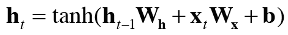

## 5.3 RNN 구현  
1. 길이가 T인 시계열 데이터 받는다.
2. 그 시각의 은닉 상태를 T개 출력한다.  
3. Time RNN 계층: 순환 구조를 펼친 후의 계층들을 하나의 계층으로 간주한다.

* (x0,x1...,xt-1) 을 묶은 xs를 입력하면 (h0, ...ht-1)을 묶은 hs를 출력하는 단일 계층  
* RNN계층 구현(한 단계) -> Time RNN 계층 구현(한거번에 구현) 

***
### 5.3.1 RNN 계층 구현  
* RNN 처리를 한 단계만 수행하는 RNN 클래스
  
  
```python
import numpy as np
class RNN:
    def __init__(self, Wx, Wh, b):
        self.params=[Wx, Wh, b]
        self.grads=[np.zeros_like(Wx), np.zeros_like(Wh), np.zeros_like(b)]
        self.cache=None
    def forward(self, x, h_prev):
        Wx, Wh, b=self.params
        t=np.matmul(h_prev, Wh)+np.matmul(x, Wx) +b
        h_next=np.tanh(t)
        self.cache=(x, h_prev, h_next)
        return h_next

    def backward(self, dh_next):
        Wx, Wh, b=self.params
        x, h_prev, h_next=self.cache
        dt=dh_next*(1-h_next**2)
        db=np.sum(dt, axis=0)
        dWh=np.matmul(h_prev.T, dt)
        dh_prev=np.matmul(dt, Wh.T)
        dWx=np.matmul(x.T,dt)
        dx=np.matmul(dt, Wx.T)
        
        self.grads[0][...]=dWx
        self.grads[1][...]=dWh
        self.grads[2][...]=db
        
        return dx, dh_prev
    
    
        
```

***
### 5.3.2 Time RNN 계층 구현  
* Time RNN 계층 : RNN 계층 T개 연결  
* 은닉 상태를 h 변수에 보관  
```python
import numpy as np
class RNN:
    def __init__(self, Wx, Wh, b):
        self.params=[Wx, Wh, b]
        self.grads=[np.zeros_like(Wx), np.zeros_like(Wh), np.zeros_like(b)]
        self.cache=None
    def forward(self, x, h_prev):
        Wx, Wh, b=self.params
        t=np.matmul(h_prev, Wh)+np.matmul(x, Wx) +b
        h_next=np.tanh(t)
        self.cache=(x, h_prev, h_next)
        return h_next

    def backward(self, dh_next):
        Wx, Wh, b=self.params
        x, h_prev, h_next=self.cache
        dt=dh_next*(1-h_next**2)
        db=np.sum(dt, axis=0)
        dWh=np.matmul(h_prev.T, dt)
        dh_prev=np.matmul(dt, Wh.T)
        dWx=np.matmul(x.T,dt)
        dx=np.matmul(dt, Wx.T)
        
        self.grads[0][...]=dWx
        self.grads[1][...]=dWh
        self.grads[2][...]=db
        
        return dx, dh_prev
    
class TimeRNN:
    def __init__(self, Wx, Wh, b, stateful=False):
        self.params=[Wx, Wh, b]
        self.grads=[np.zeros_like(Wx), np.zeros_like(Wh), np.zeros_like(b)]
        self.layers=None # RNN계층을 리스트로 저장  
        self.h, self.dh=None, None # forward 시 마지막 RNN계층의 은닉 상태 저장 / backward시 앞 블록의 은닉상태 기울기 저장 
        self.stateful=stateful #은닉 상태 유지

    def set_state(self, h):
        self.h=h
    def reset_state(self):
        self.h=None


    def forward(self, xs): #xs : 시계열 데이터 하나로 모은 것.
        Wx, Wh, b=self.params
        N,T,D=xs.shape # N(미니배치)*D차원이 T(시계열데이터)개
        D,H=Wx.shape
        
        self.layers=[]
        hs=np.empty((N,T,H),dtype='f')
        if not self.stateful or self.h is None:
            self.h=np.zeros((N,H), dtype='f')
        for t in range(T):
            layer=RNN(*self.params)
            self.h=layer.forward(xs[:,t, :], self.h)
            hs[:,t, :]=self.h
            self.layers.append(layer)
        return hs
    
    def backward(self, dhs):
        Wx, Wh, b=self.params
        N,T,H=dhs.shape
        D,H=Wx.shape
        
        dxs=np.empty((N,T,D), dtype='f')
        dh=0
        grads=[0,0,0]
        for t in reversed(range(T)):
            layer=self.layers[t]
            dx, dh=layer.backward(dhs[:,t,:]+dh)
            dxs[:,t,:]=dx
            for i, grad in enumerate(layer.grads):
                grads[i]+=grad
        for i, grad in enumerate(grads):
            self.grads[i][...]=grad
        self.dh=dh
        
        return dxs

```