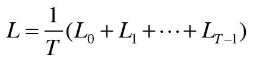

## 5.4 시계열 데이터 처리 계층 구현  
* RNN language Model 구현  

***
### 5.4.1 RNNLM 전체 그림  
1. Embedding 계층: 단어 id를 단어의 분산 표현으로 변환    
2. RNN 계층 : 단어 분산표현이 입력으로 들어간다.
3. 출력과 동시에 다음 시각의 RNN 계층으로 출력  
4. Affine 계층
5. Softmax 계층  
* 지금까지 입력된 단어를 기억하고 이를 바탕으로 다음에 출현할 단어를 예측 : RNN 계층이 과거에서 현재로 계속 데이터를 흘려보내준다.  

***
### 5.4.2 Time 계층 구현  
1. Time Embedding : 순전파 시 T개의 Embedding계층 준비하고 각 시각의 데이터 처리.  
2. Time Affine : Affine 계층 T개 준비해서 각 시각의 데이터를 개별적으로 처리하면 됨. 
3. Time Softmax with Loss : T 개의 softmax with loss계층 각각이 손실 산출 합산해 평균값이 최종 손실.  
      
   
