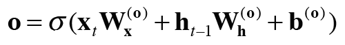
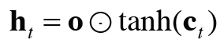
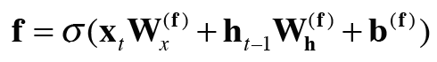
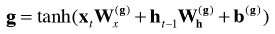
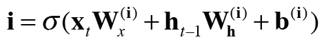

## 6.2 기울기 소실과 LSTM  
* 게이트가 추가된 RNN  
* LSTM  

***
### 6.2.1 LSTM의 인터페이스  
* 단순화한 도법 : 직사각형 노드 안에 행렬 곱, 편향의 합, tanh함수에 의한 변환 모두 포함됨.  
* LSTM 에서는 기억셀 (memory cell : c) 이라는 전용 기억 메커니즘이 있다.  
    * 데이터를 자기 자신만으로 주고받는다.  
    * LSTM 계층 내에서만 완결, 다른 계층으로 출력하지 않는다.  
    
***
### 6.2.2 LSTM 계층 조립하기  
1. 기억셀 (c_t) : 시각 t에서의 LSTM의 기억이 저장되어 있다.  과거로부터 시각 t까지에 필요한 모든 정보가 저장되어 있음.  
2. 이 기억을 바탕으로 외부 계층에 은닉상태 h_t를 출력한다. 
3. 이때 h_t 는 기억 셀의 값을 tanh 함수로 변환한 값.
4. 현재의 기억셀 c_t 는 3개의 입력 (c_t-1, h_t-1, x_t)로부터 '어떤 계산' 을 수행해 구할 수 있다.  
5. 갱신된 c_t를 사용해서 은닉상태 h_t 계산. h_t=tanh(c_t)

* 게이트의 열림 상태 : 0.0~1.0 실수로 나타낸다. -> sigmoid 함수로 계산한다.  

***
### 6.2.3 output 게이트  
* tanh(c_t) : 다음 시각의 은닉상태에 얼마나 중요한지를 조정한다. -> output 게이트  
* output 게이트의 열림 상태 게이트:  
      

* output 게이트 : (아다마르 곱 : 원소별 곱)  
      
  

***
### 6.2.4 forget 게이트  
* forget 게이트 :  불필요한 기억 잊게 해주는 게이트
      
  

***
### 6.2.5 새로운 기억 셀  
* 새로운 기억 셀 추가 : 이전 기억셀에 더해진다.  
      
  
***
### 6.2.6 input 게이트  
* input 게이트 : g 에 게이트 하나 추가 (g의 각 원소가 새로 추가되는 정보로써의 가치가 얼마나 큰지 판단.)  
      
  
***
### 6.2.7 LSTM의 기울기 흐름  
* 기억셀의 역전파는 '+'와 'x' 노드만 지난다.  
* 'x' : 행렬 곱이 아닌 원소별 곱 =아마다르 곱 으로 계산한다.  -> 매번 새로운 게이트 값을 사용해서 원소별 곱을 진행하기 때문에 곱셈의 효과가 누적되지 않아 기울기 소실이 일어나지 않는다.  
* 이때 'x'은 forget gate가 제어한다. : 잊어야 하는 기억셀 원소에 대해서는 기울기가 작아지고, 잊어서는 안 된다. 고 판단한 원소에 대해서는 기울기가 약화되지 않은 채로 과거 방향으로 전해진다.  
